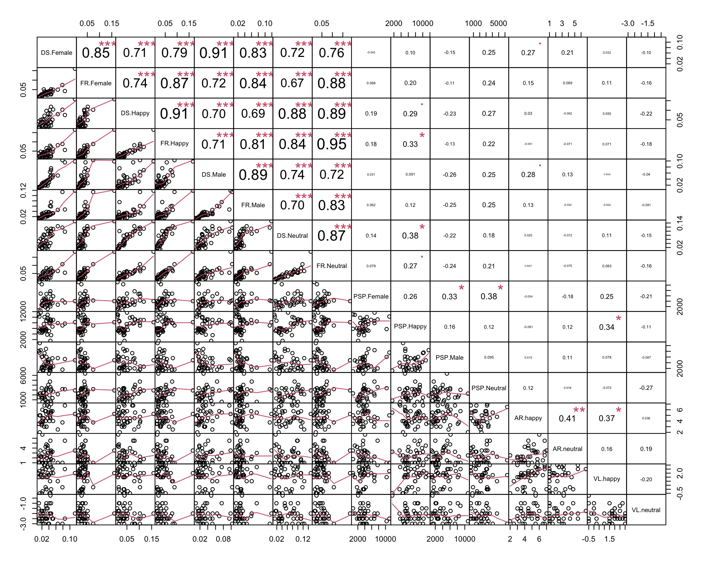

```{r setup, include=FALSE, cache=FALSE}
knitr::opts_chunk$set(echo = FALSE,
                      message = FALSE,
                      warning = FALSE,
                      fig.align = "center",
                      fig.retina = 2,
                      dev = "pdf")
```

```{r packages, cache=FALSE}
devtools::load_all()
library(here)
library(magrittr)
library(tidyr)
library(dplyr)
library(kableExtra)
library(flextable)
library(ggplot2)
library(emmeans)
library(lme4)
library(lmerTest)
library(effects)
library(tidyverse)
library(xtable)
library(ftExtra)
library(broom)
library(broom.mixed)
library(effects)
library(ggcorrplot)
library(PerformanceAnalytics)
library(pander)
library(knitr)
library(afex)

devtools::load_all()
```

```{r data}
dat <- readRDS(here("data","data.rds"))
emo <- readRDS(here("data","emotion_correlation.rds"))
gen <- readRDS(here("data","gender_correlation.rds"))
stab <- readRDS(here("data","stability.rds"))
median <- readRDS(here("data","data_median.rds"))
```


```{r functions}
tidy_prior <- function(data){
  data %>% 
    select(-source, -group, -resp, -nlpar, -lb, -ub)
}

qtab <- function(data, max_width = 6){
  data %>% 
    flextable() %>% 
    autofit() %>% 
    theme_vanilla() %>% 
    fit_to_width(max_width = max_width)
}

get_chunk_label <- function(){
  knitr::opts_current$get("label")
}

theme_paper <- function(font_size = 25){
  cowplot::theme_minimal_grid(font_size = font_size)
}

newpage <- function(){
  cat("\\newpage\n")
}
```


# General approach

We used R (R Core Team, 2012) and lme4 (Bates, Maechler & Bolker, 2012) to perform a linear mixed effects analysis of the relationship between rivalry and consciousness phases. As fixed effects, we entered rivalry and phases (with interaction term) into the model. As random effects, we had intercepts for subjects. Visual inspection of residual plots did not reveal any obvious deviations from homoscedasticity or normality. P-values were obtained by anova of the full models for gender blocks and emotion blocks:

```{r circular-brms, eval = FALSE, echo = TRUE}
fit <- lmer(mean ~ rivalry*phase + (1|subject)
```


\newpage
## model selection

The logic of the model selection is to compare the likelihood of different models. First, the model without any factor (the
null model), then each model add a factor that we are interested in.

```{r perceived-intensity-brms, eval = FALSE, echo = TRUE}

model1<-lmer(speed ~ 1 + (1|subject), dat) # null model

model2<-lmer(speed ~ phase + (1|subject), dat) # add consciousness phases: formation vs dissolution

model3<-lmer(speed ~ phase + rivalry + (1|subject), dat) # add rivalry: emotion(happy vs neutral) OR gender(male vs female)

model4<-lmer(speed ~ rivalry*phase + (1|subject), dat) # add interaction


anova(model1,model2,model3,model4)

# Stabilisation

model1<-lmer(STB ~ 1 + (1|subject), dat) # null model

model2<-lmer(STB ~ rivalry + (1|subject), dat) # add consciousness rivalry: emotion(happy vs neutral) OR gender(male vs female)

anova(model1,model2)

```

### Model selection : Emotion rivalry (Speed)


```{r circular-tables, results='asis'}
data <- dat%>%filter(procedure=="emotion")

model1<-lmer(mean ~ 1 + (1|subject), data)
model2<-lmer(mean ~ phase + (1|subject), data)
model3<-lmer(mean ~ phase + rivalry + (1|subject), data)
model4<-lmer(mean ~ rivalry*phase + (1|subject), data , contrasts = list(phase = contr.sum(2)/2, rivalry = contr.sum(2)/2))

modelselection<- anova(model1,model2,model3,model4)

modelselection%>%
  tidy()%>%
  flextable()%>%
  colformat_double(digits = 3) %>% 
  width( width = 0.8)%>%
   # set_table_properties(layout = "autofit")%>%
      theme_vanilla()%>%
  bg( i = ~ p.value < 0.05, bg = "#e6cc77", part = "body")
```

### Model selection : Gender rivalry  (Speed)

```{r intensity-tables, results='asis'}
data <- dat%>%filter(procedure=="gender")

model1<-lmer(mean ~ 1 + (1|subject), data)
model2<-lmer(mean ~ phase + (1|subject), data)
model3<-lmer(mean ~ phase + rivalry + (1|subject), data)
model4<-lmer(mean ~ rivalry*phase + (1|subject), data , contrasts = list(phase = contr.sum(2)/2, rivalry = contr.sum(2)/2))

modelselection<- anova(model1,model2,model3,model4)
modelselection%>%
  tidy()%>%
  flextable()%>%
  colformat_double(digits = 3) %>% 
  width( width = 0.8)%>%
      theme_vanilla()%>%
  bg( i = ~ p.value < 0.05, bg = "#e6cc77", part = "body")

```

\newpage
### Model selection : Emotion stability  (Cumulative time)


```{r prior-sens-circular, results='asis'}
data <- stab%>%filter(procedure=="emotion")
model1<-lmer(CT ~ 1 + (1|subject), data)
model2<-lmer(CT ~ rivalry + (1|subject), data)


modelselection<- anova(model1,model2)

modelselection%>%
  tidy()%>%
  flextable()%>%
  colformat_double(digits = 3) %>% 
  width( width = 0.8)%>%
      theme_vanilla()%>%
  bg( i = ~ p.value < 0.05, bg = "#e6cc77", part = "body")

```

### Model selection : gender stability (cumulative time)


```{r prior-sens-perceived-intensity, results='asis'}
data <- stab%>%filter(procedure=="gender")
model1<-lmer(CT ~ 1 + (1|subject), data)
model2<-lmer(CT ~ rivalry + (1|subject), data)


modelselection<- anova(model1,model2)

modelselection%>%
  tidy()%>%
  flextable()%>%
  colformat_double(digits = 3) %>% 
  width( width = 0.8)%>%
      theme_vanilla()%>%
  bg( i = ~ p.value < 0.05, bg = "#e6cc77", part = "body")

```

# Correlations tables


Correlation are not corrected for multiple comparison. Code is available here: https://osf.io/2pzmg/


### Valence, Arousal and BR measures

DS = Dissolution (Speed out)\
FR = Formation (Speed in)\
PSP = Period of stable perception\
AR  = Arousal\
VL  =  Valence\




# Medians


Here we report the predominance median, which is similar to the predominance mean (PM) but with the median instead of the mean.

```{r analysis_median}
 a1 <- aov_ez("subject", "pm", pm, within = "procedure", between = "group")
 e1 <- emmeans(a1, pairwise ~ procedure, adjust = "bonf")
# Extract ANOVA table and convert to markdown
 
 anova_table <- anova(a1)
# anova_md <- pandoc.table(anova_table)
# 
# # Add row names to the table
# rownames(anova_md) <- c("Between Groups", "Within Groups", "Interaction")
# 
# # Print the markdown table
# kable(anova_md, format = "markdown")

```


**References**

Bates, Douglas, Martin Mächler, Ben Bolker, and Steve Walker. 2014. “Fitting Linear Mixed-Effects Models Using lme4.” arXiv [stat.CO]. arXiv. http://arxiv.org/abs/1406.5823.
